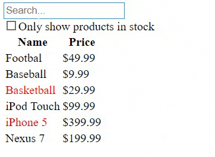

# Filterable Products Table

A very simple app that consumes a mocked JSON and shows a filterable product table.
Built with the purpose of praticing, everything based on [this tutorial](https://reactjs.org/docs/thinking-in-react.html)
All you have to do to get it working is:
```
    git clone https://github.com/guilhermebpereira/react-filterable-products-table
    cd react-filterable-products-table
    npm install
    npm start
```

